# Lab Report Week 1

[Index Page](https://rudra17381.github.io/cse15l-lab-reports/index.html)

In this week's Lab Report we will learn how to remotely connect to ```ieng6.ucsd.edu``` and run some commands on it.

## Installing Visual Studio Code
---

### Downloading VS Code
First we need to download visual studio code from the link given below.
> [Download Visual Studio Code](https://code.visualstudio.com)

It should look something like this:
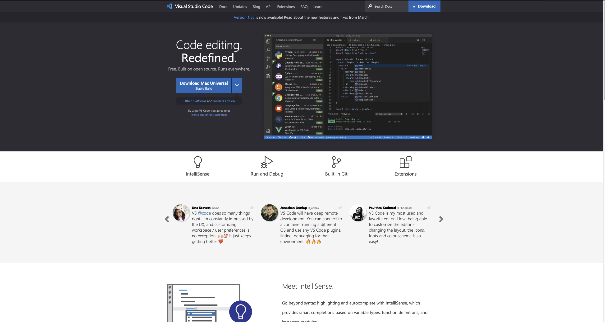

### Installing VS Code
Double click the downloaded file and follow the instructions to install visual studio code on your local computer

## Remotely Connecting
---

Often in real life situations be it normal jobs, businesses or scientific research, anything relating to IT will have you log into a remote server or computer to do your work. This may be due to security reasons, having to work with files that couldn't fit on local machines or simply local machines not having enough computing power to process the work you are trying to do. Due to this reason it is a good idea for organizations to have remote servers which can be powerful, have a large memory storage and be secure which allows all of its employees to be able to work with the same computing power and storage. In UCSD as well we have remote servers and IT services where we can log in and do our work. Often, CSE courses will have their work on these course specific servers and accounts. This course, CSE 15L is one such example where we need to be able to log into the remote server. 

Follow these steps to remotely connect to the server

1. **Install Open SSH if you are on a windows computer from the link below**
> [Open SSH](https://docs.microsoft.com/en-us/windows-server/administration/openssh/openssh_install_firstuse)
2. **Look up your course specific account from the link below**
> [UC San Diego Educational Technology Services](https://sdacs.ucsd.edu/~icc/index.php)
3. **Connecting to remote host**
    * Open the terminal in VS Code.
    * Type in the following command: ```ssh cs15lsp22zz@ieng6.ucsd.edu```  
    ```ssh``` here is the secure protocol that allows us to connect to the remote server.  
    ```cse15lsp22zz``` here is the user
        * ```cse15l``` is the course name 
        * ```sp22``` is the quarter (spring quarter 2022)
        * ```zz``` is your course specific account name
    ```ieng6.ucsd.edu``` is the host name where we will be connecting to.
    * Connecting to it the first time you should see the following message  
    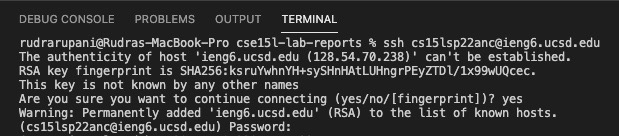
    * Your client PC is now connected to a host UCSD server computer and it should look something like this.  
    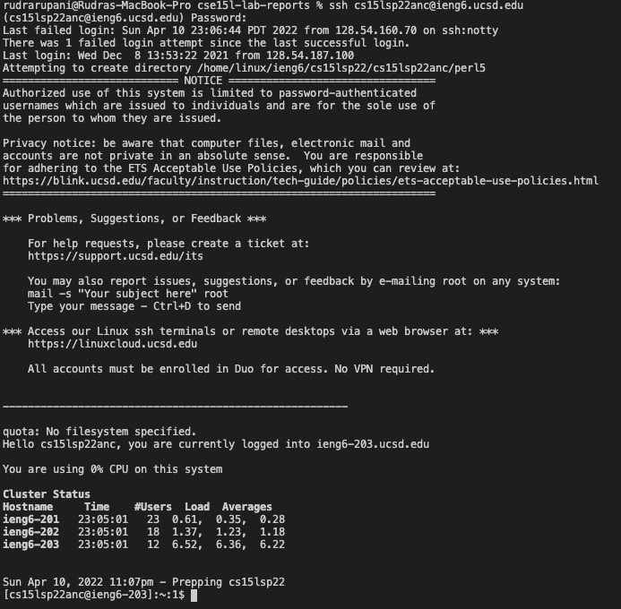


## Trying Some Commands
---

There are many easy to learn commands that can help you navigate the host computer and use it as if its your own computer. These are command line commands so they are slightly different that the GUI interface of your computer that you may be used to but it should not be too difficult to pick up.
Note that these commands can be used on your own local computer as well.

### Some Example Commands:
* ```cd```: This command helps you change the current directory that you are in.
* ```ls```: This command lists out all the files in the current directory.
* ```pwd```: This command prints out the whole path from the root directory to the current directory.
* ```mkdir```: This command creates a new empty directory with the name you give it.
* ```cp```: This command is used to copy files, groups of files or directories.
* ```-l```: This is sorta like a modifier, with ```ls``` it lists out all files and directories in long format.
* ```-a```: This is sorta like a modifier, with ```ls``` it lists out all files and directories wether they are hidden or not.
* ```-t```: This is sorta like a modifier, with ```ls``` it lists out all the files sorted by the time of last modification.

### Try running some useful commands and seeing their output (Used from Lab1):
* ```cd ~```: Should change your current directory to home directory.
* ```cd "child directory"```: Should change your current directory to one of its children.
* ```ls -lat```: Should list out all the files in the current directory in long format regardless of wether they are hidden or not. These files should be sorted by the date they were last modified. Notice how ```-lat``` is a combination of ```-l``` ```-a``` and ```-t```.
* ```ls /home/linux/ieng6/cs15lsp22/cs15lsp22abc``` where ```abc``` is your course specific account: This should display all the files in this current directory.
* ```cp /home/linux/ieng6/cs15lsp22/public/hello.txt ~/```: Should copy the file on location 1 (in this case ```hello.txt```) to location 2 (in this case the root directory.)
* ```cat /home/linux/ieng6/cs15lsp22/public/hello.txt```: Should print out the contents of ```hello.txt```.

**Press ```Ctrl + D``` or Run the ```exit``` command to exit the terminal.**

### Running Some Commands on a Local Client PC:
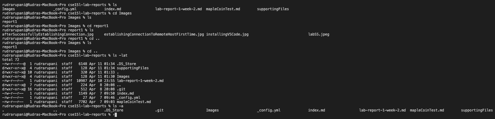

### Running Some Commands on Remote Host UCSD Server:
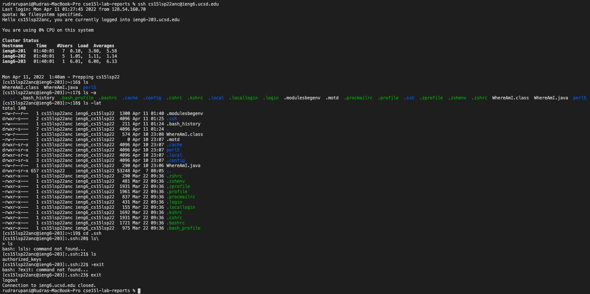

## Moving Files with ```scp```
---

One usual sitaution you might run into while working on a remote server is needing to move or copy files form the remote host to the local client computer. There may be many reasons for this: 
* Wanting to work offline, while on a bus or at home with unstable internet connection
* Having key files that may disrupt the server if there are any errors (in this case running them on a virtual machine or on a local client computer before pushing it to the remote server may be ideal to spot out errors and prevent it from causing collateral damage)
* Simply wanting faster read and write times for smaller files or datasets while testing multiple different AI models or programs (uploading or downloading files for each test is slow as the speed can be max a few hundered megabytes meanwhile the SSD on your local client PC has often read and write speeds of several gigabytes)

Whatever the reason may be, it is important to learn how to move files over ```ssh``` using ```scp```.

Note: The command ```scp``` is always run from the client and not from the host.

### A program to print current location (Used from Lab1):
Install Java on your computer using the following tutorial and create a file called ```WhereAmI.java``` and paste the following code into it.

* [Installing Java Windows](https://phoenixnap.com/kb/install-java-windows)  
* [Installing Java MacOS](https://www.geeksforgeeks.org/how-to-install-java-on-macos/)  
* [Installing Java LINUX](https://opensource.com/article/19/11/install-java-linux)

Code to paste:
```
class WhereAmI {
    public static void main(String[] args) {
        System.out.println(System.getProperty("os.name"));
        System.out.println(System.getProperty("user.name"));
        System.out.println(System.getProperty("user.home"));
        System.out.println(System.getProperty("user.dir"));
    }
}
```

* Compile the file using ```javac```: ```javac WhereAmI.java```  
* Run the file using ```java```: ```java WhereAmI```

Doing so will give you the path to the current directory easily.  

### Running the Program on a Local Client PC:
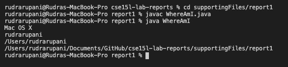

### Moving the ```Where Am I.java``` Program to the Remote Server Using ```scp```(Used from Lab1):
Go to the terminal and run the following command ```scp WhereAmI.java cs15lsp22zz@ieng6.ucsd.edu:~/``` where ```zz``` is your course specific account name.

Your file should now be copied to the remote server on the course specific account that you have. Use the ```ls``` command to view all files in the current directory and ensure that ```WhereAmI.java``` is there.  
Java is already installed on these servers so you can use ```javac``` and ```java``` commands to compile and run the file respectively.
* Compile the file using ```javac```: ```javac WhereAmI.java```  
* Run the file using ```java```: ```java WhereAmI```

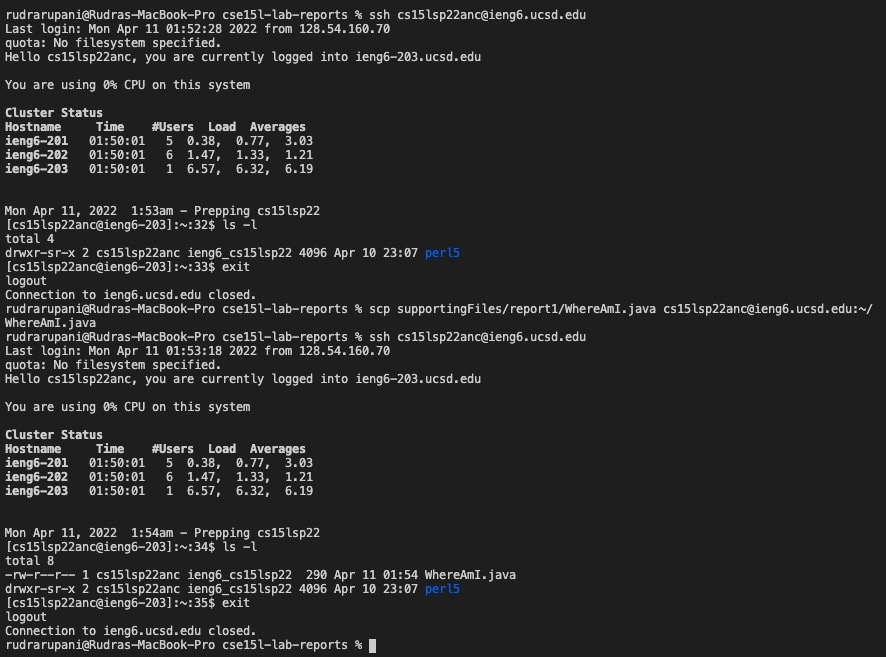

### Running the Program on Remote Host UCSD Server:
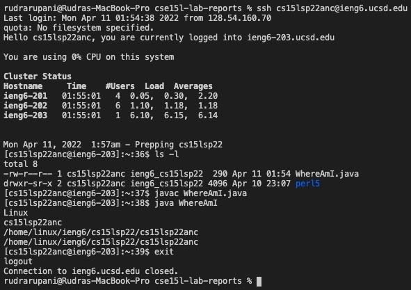

## Setting an SSH Key
---

Typing your password every time to log into the server for every little thing can get annoying. So you may come up with the idea of having the client and host computers recognize each other by default so that you do not have to enter your password to verify your identity. There is just the way to do that using Asymmetric encryption or more specifically RSA (the most widely used asymmetric encryption algorithm)

> [Read up more on fascinating history and mechanics and mathematics behind RSA here](https://en.wikipedia.org/wiki/RSA_(cryptosystem))

**```ssh``` keys help us accomplish this goal.** ```ssh-keygen``` is the program that creates the pair of asymmetric keys. One key is copied to the remote host server meanwhile the other key is kept by your local client computer.

### Here are the steps for setting up your own ```ssh``` keys:
* On the client computer.
1. Run ```ssh-keygen```
2. Enter ```/Users/<user-name>/.ssh/id_rsa```
3. Do not add a passphrase here.
4. It should look something like this:
```
rudrarupani@Rudras-MacBook-Pro cse15l-lab-reports % ssh-keygen
Generating public/private rsa key pair.
Enter file in which to save the key (/Users/rudrarupani/.ssh/id_rsa): /Users/rudrarupani/.ssh/id_rsa
Enter passphrase (empty for no passphrase): 
Enter same passphrase again: 
Your identification has been saved in /Users/rudrarupani/.ssh/id_rsa
Your public key has been saved in /Users/rudrarupani/.ssh/id_rsa.pub
The key fingerprint is:
SHA256:fTLFxwPuCxa9Qp5LrIwkR3zQ9ZWa206/r6VstPNjz9s rudrarupani@Rudras-MacBook-Pro.local
The key's randomart image is:
+---[RSA 3072]----+
|       .. .. .ooo|
|      . ..  +..+.|
|       o . o ++ .|
|      . ..+ +=.  |
|     . oS .O*o   |
|      + o +o++.  |
|       . o .+... |
|           ..=o+.|
|            o*B+E|
+----[SHA256]-----+
```

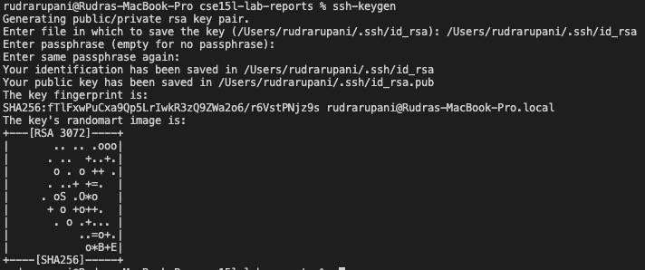

These steps should've created two different files on your local client pc, one named ```id_rsa``` which is the private key and the other named ```id_rsa.pub``` which is the public key. Both of these files are stored in the ```.ssh``` directory of your local client computer.

Now that we have created the pair of asymmetric keys, we need to copy the public key to the remote host server that we have.

### To do so, follow the steps below: (Used from Lab1)
1. Log into the remote host server. Here ```zz``` is your course specific account.
```ssh cs15lsp22zz@ieng6.ucsd.edu``` 
2. Make a new empty directory to keep the RSA public key.
```mkdir .ssh```
3. Log out from the remote host server.
4. Copy the public key over ```ssh``` using ```scp``` from your local client computer to the remote host server. Here ```<user-name>``` is your user name and ```zz``` is your course specific account
```scp /Users/<user-name>/.ssh/id_rsa.pub cs15lsp22zz@ieng6.ucsd.edu:~/.ssh/authorized_keys```

Done! You should now be able to ```ssh``` or ```scp``` without having to type in your password.

## Optimizing Remote Running
---

1. You can run commands directly in one line using ```""``` double qoutes. The following command will list out all files in the remote directory.
```ssh cs15lsp22zz@ieng6.ucsd.edu "ls"```
2. You can run multiple commands in one line using ```;``` semicolons. For example:
```cp WhereAmI.java OtherMain.java; javac OtherMain.java; java WhereAmI```

### Example of Optimized Remote Running

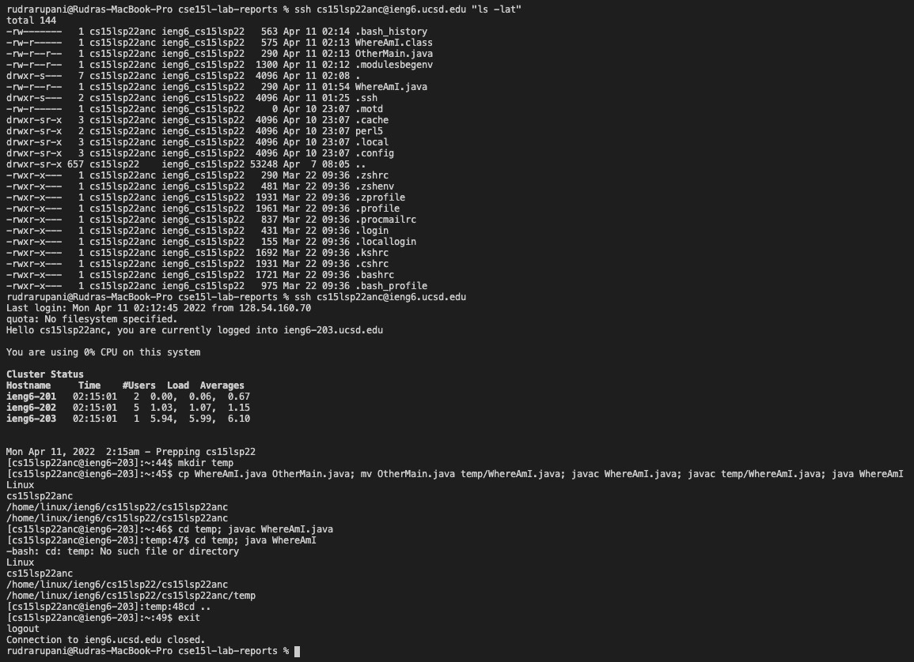

## Screenshot from lab work
---
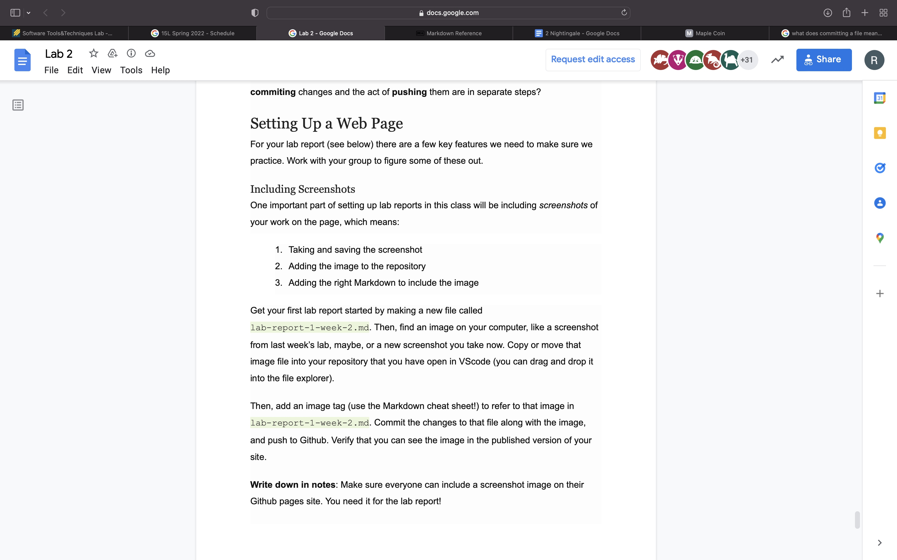hello_this_is_from_ieng6
