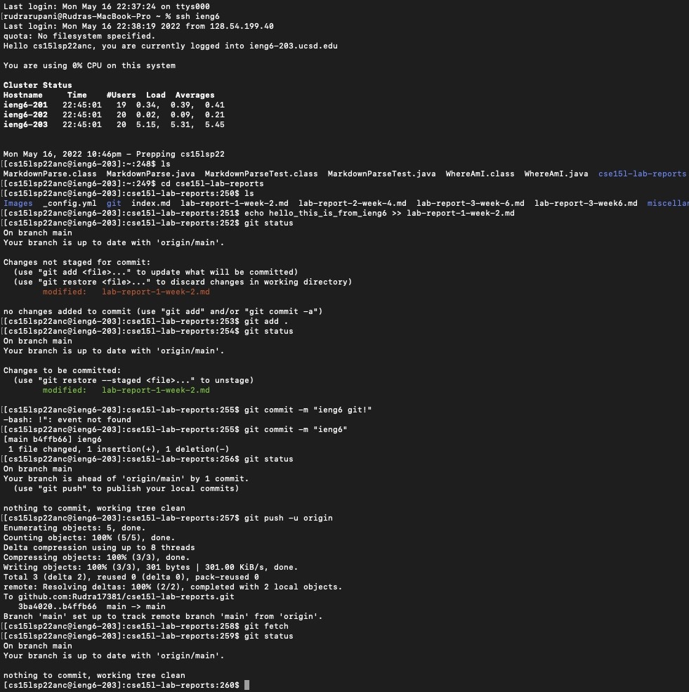
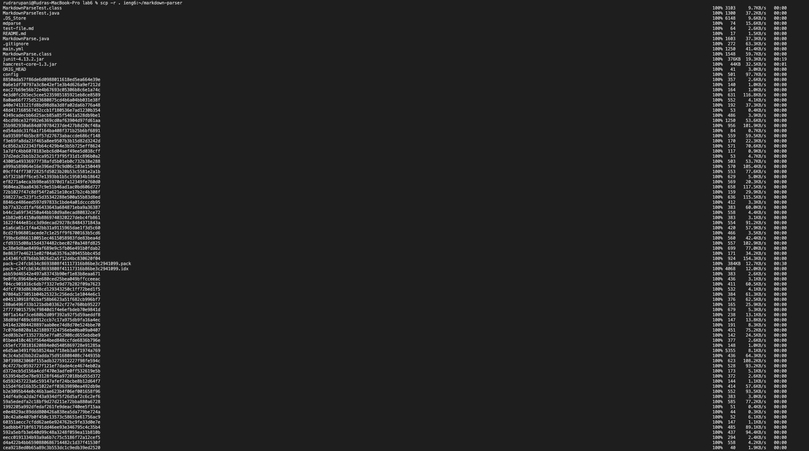
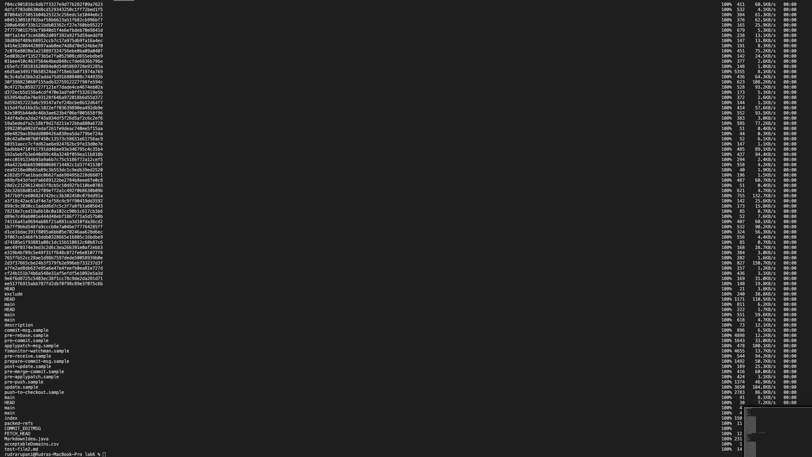

# Lab Report Week 3

[Index Page](https://rudra17381.github.io/cse15l-lab-reports/index.html)

In this week's Lab Report we will learn how to implement group choice questions from [Lab 5](https://docs.google.com/document/d/1NQ17hecUPFKeoFyrEvK9DBlCS1JkDbMW6Ygrf_CJJJU/edit).

## Streamlining ```ssh``` Configuration

In previous labs and lab reports, we have taken a lot at how to use remote pcs to do our work using ieng6. Having to access it often, it becomes a tedious and annoying task.

```ssh cs15lsp22zzz@ieng6.ucsd.edu```

First you need to remember the course name, then your account specific name and not to mention type it all out perfectly in one go (Almost an impossible task) 

If only there could be a way to automatically type this from a smaller command- obviously there is a way since all of us programmers are lazy and find any and every excuse to automate stuff.

### To do so, follow these steps:
**On your client PC**
1. Open up Terminal
2. Open up your ```ssh``` config file using the command: ```open .ssh/config```
    * If the ```ssh``` file does not exist, you can create it using ```touch .ssh/config.txt```
3. Add the following lines to the config file:
    ```
        Host ieng6
        HostName ieng6.ucsd.edu
        User cs15lsp22zzz (use your username)
      ```

Done! You have now made it easier to log into your ieng6 account. To log in, use the following command: 
```ssh ieng6```

If this does not work then add a line to your config file explicitly refering to the id_rsa file using the following command:
```echo     IdentityFile ~/.ssh/id_rsa >> .ssh/config``` or just open the file and manually edit in the line ```IdentityFile ~/.ssh/id_rsa```

Below are screenshots for the lab report and to help you out if you're a little stuck
1. ```.ssh/config``` File and how I accessed it
    * Accessing the file
    * The file and its text contents

2. Logging in using ```ssh ieng6```

3. Copying files using ```scp file ieng6```

### Lab report 3 screen shots:
#### Streamlining ssh Configuration
1. Show your .ssh/config file, and how you edited it (with VScode, another program, etc)

2. Show the ssh command logging you into your account using just the alias you chose.

3. Show an scp command copying a file to your account using just the alias you chose.


## Set up Github Access from ieng6

In efforts to increase Security, Github made it so that you need to use a token based login mechanism like SSH keys to log into your github account to be able to commit and push the changes you made to your project instead of just a password

As a matter of fact, if I try to do it right now, you'll see an error.

### To set up github access from command line you will need to follow the steps in these two tutorials to set up your SSH key in github and your Personal authentication token. 
1. [SSH Tutorial](https://docs.github.com/en/authentication/connecting-to-github-with-ssh/adding-a-new-ssh-key-to-your-github-account)
2. [PAT Tutorial](https://docs.github.com/en/authentication/keeping-your-account-and-data-secure/creating-a-personal-access-token)

### Now we implement the same into our course specific account on the remote server:
1. log into ```ieng6``` using ```ssh ieng6```
2. Either transfer already generated keys from local computer to your course specific account using ```scp``` or follow the next step to generate keys locally on the remote server
3. Use ```ssh-keygen``` command
    * You should see the following output:
    ```
    Generating public/private rsa key pair.
    Enter file in which to save the key (/Users/gerald/.ssh/id_rsa):
    ```
    After which you enter in the path to your ssh account + ```.ssh/id_rsa_github```
    Which will create the new ```ssh``` key in the id_rsa_github file in the hidden folder ```.ssh```
4. Follow the [SSH Tutorial](https://docs.github.com/en/authentication/connecting-to-github-with-ssh/adding-a-new-ssh-key-to-your-github-account) again and insert this new key into your github account
5. On your course specific account enter the following commands to switch to the proper user:
    ```
    git config --global user.name "Your Name"
    git config --global user.email you@example.com
    ```
6. In the .ssh directory, modify the config file and append the following to it
    ```
    Host github.com
     HostName github.com
     User "your username"
     IdentityFile ~/.ssh/id_rsa_github
    ```
    by either editing it or echoing it using the following command
    ```
    echo "Host github.com
       HostName github.com
       User Rudra17381
       IdentityFile ~/.ssh/id_rsa_github" >> config 
    ```
8. You can test your connection to github using the following command ```ssh -T git@github.com``` if everything is set up right then you should see your user name pop up

9. Making your local repository remote from HTTPS to SSH
    1. ```git remote -v``` using the following  command should give an output like this:
    ```
    origin  https://github.com/USERNAME/REPOSITORY.git (fetch)       
    origin  https://github.com/USERNAME/REPOSITORY.git (push)
    ```
     This means that currently your remote repository is set to HTTPS, we need to change it to ssh to use the ssh key created previously  
    2. Use the following command: ```git remote set-url origin git@github.com:USERNAME/REPOSITORY.git```  
    3. Use the first command again and you should see the following result
    ```
    origin  git@github.com:USERNAME/REPOSITORY.git (fetch)
    origin  git@github.com:USERNAME/REPOSITORY.git (push)
    ```

10. You are done now! You can perform git operations as normal now using ssh

### Lab report 3 screen shots:
1. Show where the public key you made is stored on Github and in your user account (screenshot).

2. Show where the private key you made is stored on your user account (but not its contents) as a screenshot.

3. Show running git commands to commit and push a change to Github while logged into your ieng6 account.

3. Show a link for the resulting commit.  
[https://github.com/Rudra17381/cse15l-lab-reports/commit/b4ffb66a9a849a63cfcd07dcf5bcf8b7dbe4a274](https://github.com/Rudra17381/cse15l-lab-reports/commit/b4ffb66a9a849a63cfcd07dcf5bcf8b7dbe4a274)


## Copying entire directories with ```-scp```

Often there are situations where we may need to copy entire directories over to a remote server. Say for instance a project or the junit files in ```./lib```.
Copying each file by hand is a cumbersome and tedious task.

Take this directory for example:
```
directory
    file1
    /subDirectory1
        file2
        file3
    /subDirectory2
        file4
        file5
        file6
        /subDirectory3
            file7
```

Copying this to ieng6 line by line would look something like this:
```
ssh ieng6
mkdir directory
cd directory
mkdir subDirectory1
mkdir subDirectory2
cd subDirectory2
mkdir subDirectory3
exit
scp file1 ieng6:~/
scp file2 ieng6:~/directory/subDirectory1
scp file3 ieng6:~/directory/subDirectory1
scp file4 ieng6:~/directory/subDirectory2
scp file5 ieng6:~/directory/subDirectory2
scp file6 ieng6:~/directory/subDirectory2
scp file7 ieng6:~/directory/subDirectory2/subDirectory3
```

That took us a total of 14 lines of commands! just to copy a single directory over which is kinda insane.

Thankfully there is a way to solve this and accomplish the same 14 lines of code with a built in command. 

### To copy an entire directory using scp use the following command:
```scp -r . ieng6:~/directoryOnRemoteServer```

Here, ```-r``` means recursively go through all the files and directory of-
```.``` means the current directory we are in. This is also the source of the files so if you want to copy a sub directory then just replace . with the name of the sub directory

Another useful piece of information is filtering what files to copy to do so replace file name or extension with ```*```

For example: ```scp -r *.java *.md ieng6:~/directoryOnRemoteServer``` will copy all the files with the extensions ```.java``` and ```.md```

### Lab report 3 screen shots:
1. Show copying your whole markdown-parse directory to your ieng6 account.


2. Show logging into your ieng6 account after doing this and compiling and running the tests for your repository.

3. Show (like in the last step of the first lab) combining scp, ;, and ssh to copy the whole directory and run the tests in one line.
